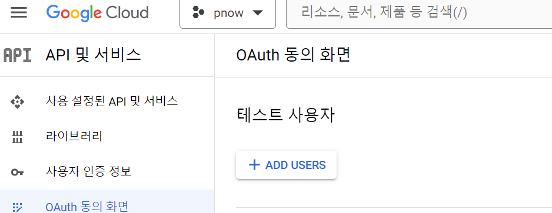

# Error handling for YouTube authentication process.

## Configuration Differences Between Local Development and Production Environments
When using the project in a local development environment versus running the service in production. If you encounter errors during the authentication process in local development, try the following changes.

---
---
> :fire: CAUTION :fire: 
Current `credentials = flow.run_console()` provided in the official documentation does not work due to compatibility issues between Google packages. The solution to this problem seems to be installing compatible Google packages. Research is ongoing in this area.
---
---

### 1. If you see a message about asking the developer for access.
It means you don't have permission to access the test app. Add your email as a test user in the Google Cloud Console like below.


### 2. Disable OAuthlib's HTTPS verification when running locally.
```python
# This setting is crucial for local development env.
os.environ["OAUTHLIB_INSECURE_TRANSPORT"] = "1"
```

### 3. If you see Tell OAuth 2.0 authentication process, it's local.
If you see a message about connection issues like **redirect_uri_mismatch**
```python
# credentials = flow.run_console()
credentials = flow.run_local_server(port=11196) # set the port number
```

## AttributeError: 'InstalledAppFlow' object has no attribute 'run_console' Issue.
According to the [google-api-python-client/CHANGELOG](https://github.com/googleapis/google-api-python-client/blob/3fb2a386892a695a0a7be33b499b37a9a75b2439/CHANGELOG#L17), they changed the method for a more secure connection almost a decade ago, yet the code in the beginner's guide has not been updated. It's quite strange.

This is references for later.

**google_auth_oauthlib** 
- [google_auth_oauthlib package](https://google-auth-oauthlib.readthedocs.io/en/latest/reference/google_auth_oauthlib.html)
    - [google_auth_oauthlib.flow module](https://googleapis.dev/python/google-auth-oauthlib/latest/reference/google_auth_oauthlib.flow.html)
    - [Source code for google_auth_oauthlib.flow](https://googleapis.dev/python/google-auth-oauthlib/latest/_modules/google_auth_oauthlib/flow.html#Flow.authorized_session)
- [google-auth-library-python-oauthlib](https://github.com/googleapis/google-auth-library-python-oauthlib)
- [Using OAuth 2.0 to Access Google APIs](https://developers.google.com/identity/protocols/oauth2?hl=ko)
    - [OpenID Connect](https://developers.google.com/identity/openid-connect/openid-connect?hl=ko#python)
- Some likely code : [link](https://developers.google.com/people/quickstart/python)

**googleapiclient** 
- [google-api-python-client](https://github.com/googleapis/google-api-python-client)

**Etc.**
- [Python quickstart](https://developers.google.com/people/quickstart/python)
- version conflict
```python
# This can be work.
google-api-python-client==1.7.2
google-auth==1.8.0
google-auth-httplib2==0.0.3
google-auth-oauthlib==0.4.1
```